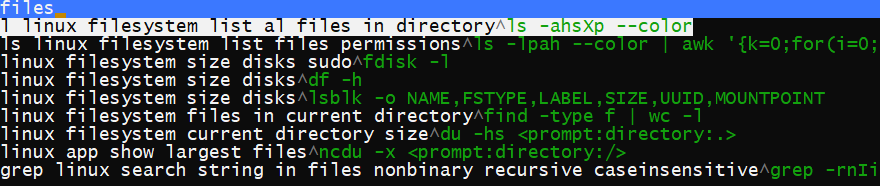

# Terminal command bookmark manager

Save your terminal commands in one place. 
Then find command through searchable dropdown.
Written in go, primarily for LInux.



## Dependencies
Verify you have go installed [golang](https://github.com/golang/go)
```console
go version
```
Get dependencies ([github.com/rivo/tview](https://github.com/rivo/tview))
```console
go get github.com/rivo/tview
```
## Building:

```console
./build.sh
```
Will build `cli` executable in current directory

## Creating bookmarks
* Bookmarks are simply terminal commands.
* Add them in `commands.sh` file (They will be hardcoded in executable at compile time)
* Words in comment line before command (in `commands.sh`) become search keywords in executable:
```bash
#linux list directories
ls
```
becomes:
```console
linux list directories^ls
```
* Bookmarks support user input with default values. Bookmark such as `du -hs <prompt:enter directory:.>` will ask for input string which will replace "prompt" tag. If user enters no characters default value (in parentheses) will be used.

Example with `.` as default value:
```console
$ ./cli
prepare comm: du -hs <prompt:enter directory:.>
enter directory (.): /tmp
executing: du -hs /tmp

54M     /tmp
```

## Using program

### Standard way:
```console
./cli
```

### Shortcut way
```console
./cli ls
```
will execute first bookmark it finds with passed argument as a console command `ls linux filesystem list files permissions^ls -lpah --color | awk '{k=0;for(i=0;i<=8;i++)k+=((substr($1,i+2,1)~/[rwx]/)*2`: 
```console
ls -lpah --color | awk '{k=0;for(i=0;i<=8;i++)k+=((substr($1,i+2,1)~/[rwx]/)*2
```


### Make it accessible from any directory by copying to your favourite bin directory
```console
ln -s /currentdir/cli /usr/bin/yournewcli
```

## Syntax

### CLI Arguments
`print` print next script without running it  
`-v ` print version

### Script directives
#### Prompt
```console
<prompt:info text[:default value]>
```

